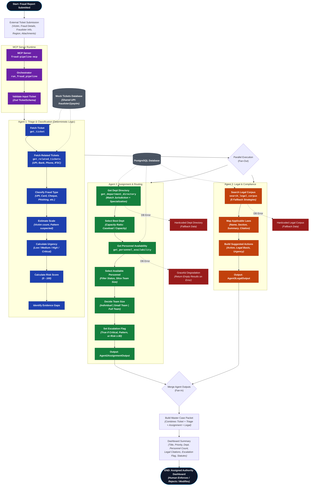

# Fraud Line Detection — Multi-Agent Fraud Reporting & Triage System

A **multi-agent fraud reporting & triage system** built as an **MCP (Model Context Protocol) server** using the `@nitrostack/core` framework. It processes financial fraud tickets through a deterministic pipeline of 3 agents, producing a **Master Case Packet** with triage classification, department assignment, and legal guidance.

**Tech Stack:** TypeScript, Node.js, PostgreSQL, Zod validation, MCP protocol, `@nitrostack/core`

---

## System Architecture Flowchart



---

## Pipeline Overview

The system processes fraud reports through a **deterministic 3-agent pipeline**:

| Step | Component | Description |
|------|-----------|-------------|
| 1 | **Orchestrator** | Validates the input ticket and initiates the pipeline |
| 2 | **Agent 1 — Triage** | Classifies fraud type, estimates scale/urgency/risk, detects patterns |
| 3 | **Agent 2 — Assignment** | Routes the case to the best department and personnel |
| 4 | **Agent 3 — Legal** | Searches legal corpus for applicable laws and suggested actions |
| 5 | **Merge** | Combines all outputs into a Master Case Packet with dashboard summary |

> **Key Design Decision:** The orchestrator is **deterministic backend code**, not an LLM. LLMs decide *content* (classification, assignment, legal suggestions); the backend decides *flow*. This ensures the order of operations is auditable and reproducible.

---

## MCP Tools Exposed

| Tool | Used By | Purpose |
|------|---------|---------|
| `get_ticket(ticket_id)` | Agent 1 | Fetch raw fraud ticket by UUID |
| `get_related_tickets(criteria)` | Agent 1 | Find tickets sharing fraudster identifiers (pattern detection) |
| `get_department_directory(jurisdiction, specialization)` | Agent 2 | Find matching departments with capacity data |
| `get_personnel_availability(department_id)` | Agent 2 | Get personnel with availability status |
| `search_legal_corpus(fraud_type, jurisdiction, query?)` | Agent 3 | RAG search over legal/regulatory corpus |
| `run_fraud_pipeline(ticket)` | Orchestrator | End-to-end pipeline execution |

---

## Agent Output Schemas

### Agent 1 — Triage & Classification

```json
{
  "ticket_id": "uuid",
  "fraud_type": "upi_fraud | card_fraud | cheque_fraud | phishing | investment_scam",
  "scale": {
    "victim_count_estimate": 1,
    "pattern_suspected": false,
    "related_ticket_ids": []
  },
  "urgency": {
    "level": "low | medium | high | critical",
    "revocability_window_remaining": "estimate, not authoritative",
    "reasoning": "..."
  },
  "risk_score": 0,
  "evidence_gaps": []
}
```

### Agent 2 — Assignment & Routing

```json
{
  "ticket_id": "uuid",
  "assigned_department_id": "uuid",
  "assigned_personnel": [{ "id": "uuid", "role": "officer" }],
  "team_size_recommendation": "individual | small_team | full_team",
  "reasoning": "...",
  "escalation_flag": false
}
```

### Agent 3 — Legal & Compliance

```json
{
  "ticket_id": "uuid",
  "jurisdiction": "IN-KA",
  "applicable_laws": [
    {
      "name": "IT Act 2000",
      "section": "66C",
      "summary": "...",
      "source_url": "https://...",
      "relevance": "..."
    }
  ],
  "suggested_actions": [
    {
      "action": "...",
      "legal_basis": "IT Act 2000 66C",
      "urgency": "high",
      "citation": "https://..."
    }
  ],
  "confidence_notes": "..."
}
```

---

## Key Design Decisions

### 1. Deterministic Orchestration
The pipeline controller is backend code, not an LLM. This ensures the order of operations is auditable and reproducible — critical for legal/financial decisions.

### 2. Agent Isolation
Agents 2 and 3 only see Agent 1's structured JSON output, never the raw ticket. This keeps prompts focused and outputs independently validatable.

### 3. Graceful Degradation
Every database-backed tool has hardcoded fallback data. If PostgreSQL is unreachable, the pipeline still works with static data.

### 4. Multi-layered Legal Search
The legal corpus search uses 5 fallback strategies: exact match → keyword ILIKE → keyword without query → jurisdiction-only → broad digital-payment fallback.

### 5. Fraud Type Normalization
The system handles verbose fraud descriptions like "UPI QR Code Scam (Organized/Repeat)" and extracts canonical fraud types using keyword-to-fraud-type maps.

---

## Project Structure

```
src/
├── index.ts                              # MCP server entry point
├── app.module.ts                         # Root application module
├── modules/fraud-pipeline/
│   ├── fraud-pipeline.module.ts          # Pipeline module registration
│   ├── ticket.tools.ts                   # get_ticket, get_related_tickets tools
│   ├── triage-agent.prompts.ts           # Agent 1 prompt definitions
│   ├── triage-agent.system-prompt.ts     # Agent 1 system prompt
│   └── mock-tickets.ts                   # 4 mock tickets for testing
├── agent-2-assignment/
│   ├── assignment.tools.ts               # get_department_directory, get_personnel_availability
│   └── assignment-agent.prompts.ts       # Agent 2 prompt definitions
├── agent-3-legal/
│   ├── legal.tools.ts                    # search_legal_corpus tool
│   └── legal-agent.prompts.ts            # Agent 3 prompt definitions
├── orchestrator/
│   ├── pipeline.orchestrator.ts          # Deterministic pipeline controller
│   └── case-packet.schema.ts             # Master Case Packet schema
├── schemas/
│   ├── common.ts                         # Shared Zod schemas
│   ├── ticket.schema.ts                  # Ticket data model
│   ├── agent-output.schema.ts            # Agent 1/2/3 output schemas
│   └── department.schema.ts              # Department & Personnel schemas
├── db/
│   └── pool.ts                           # PostgreSQL connection pool
└── health/
    └── system.health.ts                  # System health check
```

---

## Getting Started

### Prerequisites
- Node.js 18+
- PostgreSQL (optional — system works with fallback data)

### Installation

```bash
# Install dependencies
npm install

# Set up environment
cp .env.example .env
# Edit .env with your DATABASE_URL if using PostgreSQL

# Run in development mode
npm run dev
```

### Environment Variables

| Variable | Description | Required |
|----------|-------------|----------|
| `DATABASE_URL` | PostgreSQL connection string | No (falls back to mock data) |
| `NODE_ENV` | `development` or `production` | No (defaults to development) |

---

## License

MIT