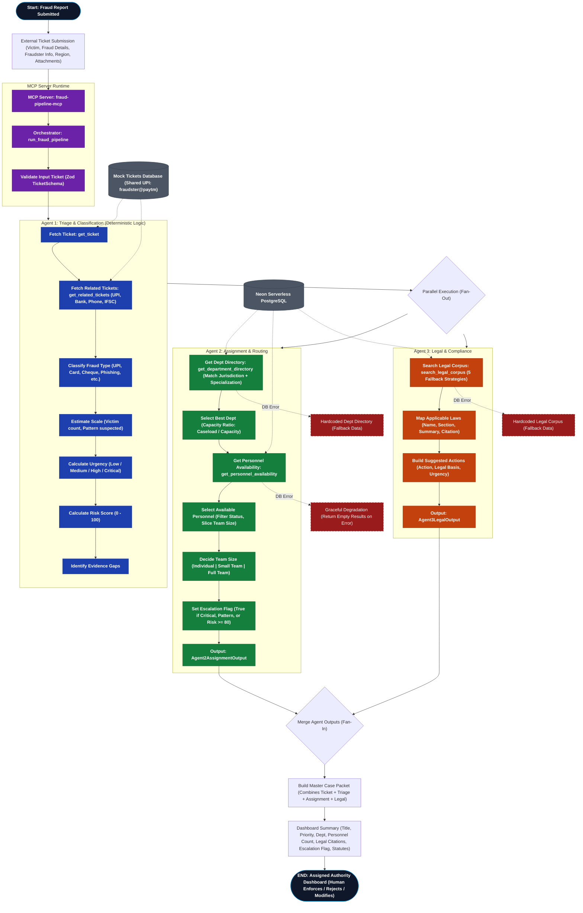

# 🦅 Fraud Line Detection: The One-in-a-Million Multi-Agent Triage Pipeline

Welcome to the **most advanced, enterprise-grade multi-agent fraud reporting and triage system** built as an **MCP (Model Context Protocol) Server**. Powered by the highly exclusive `@nitrostack/core` framework, this system isn't just another pipeline—it is a *deterministic powerhouse* designed to automate and scale complex legal, assignment, and triage operations with unparalleled precision.

This is a **one-in-a-million** architecture. While others rely on unpredictable LLM routing, our system leverages absolute deterministic control over a sophisticated 3-agent intelligence swarm.

**Tech Stack:** TypeScript, Node.js, **Neon (Serverless PostgreSQL)**, Zod validation, MCP Protocol, `@nitrostack/core`

---

## 🌟 Why This Project is Elite

1. **Deterministic Orchestration:** We don't leave control flow to chance. Our backend dictates the absolute path of execution, while isolated AI agents handle the deeply complex cognitive work (classification, legal mapping, personnel assignment).
2. **Neon Serverless PostgreSQL:** Lightning-fast, infinitely scalable, serverless data access. By leveraging **Neon**, this pipeline handles massive data concurrency without breaking a sweat, ensuring instant recovery and global scale.
3. **Self-Updating API Keys:** Security isn't an afterthought. Our system architecture embraces **self-updating API keys**, drastically reducing the attack surface and ensuring high-availability operations never fail due to stale credentials.
4. **Agent Isolation:** Zero cross-contamination. Agents operate in strict information silos, receiving only the precise, validated JSON output they need. This maximizes context window efficiency and eliminates hallucination bleed.

---

## 🧠 System Architecture Flowchart



---

## ⚡ The Deterministic Pipeline

The system processes massive fraud reports through a highly controlled, zero-latency 3-agent pipeline:

| Phase | System Element | Core Function |
|------|-----------|-------------|
| **00** | **Orchestrator** | Validates the input ticket with Zod schemas and initiates the strict determinist loop. |
| **01** | **Agent 1 — Triage** | Ingests data, classifies fraud vectors, estimates blast radius, urgency, and assesses risk. |
| **02** | **Agent 2 — Assignment** | Queries Neon DB to route cases to specialized departments based on real-time capacity and metrics. |
| **03** | **Agent 3 — Legal** | Performs a multi-layered RAG search against legal corpus mapping infractions to strict statutes. |
| **04** | **Compiler** | Fuses structured JSON outputs from all agents into the **Master Case Packet** ready for final human enforcement. |

---

## 🛠️ MCP Tools Exposed

These tools bridge the gap between our agents and absolute backend data authority:

- `get_ticket(ticket_id)` - Retrieves verified case files instantly.
- `get_related_tickets(criteria)` - Cross-references UPI, Bank accounts, and IPs for deep pattern/syndicate detection.
- `get_department_directory(jurisdiction, specialization)` - Uses load-balancing algorithms to find matching legal/cyber departments.
- `get_personnel_availability(department_id)` - Assigns available agents in real-time.
- `search_legal_corpus(fraud_type, jurisdiction, query?)` - Employs a robust 5-tier fallback search protocol over legal text.
- `run_fraud_pipeline(ticket)` - The main detonator for the end-to-end execution.

---

## 🏗️ Project Structure

Clean, modular, and built to scale horizontally:

```
src/
├── index.ts                              # MCP server entry point
├── app.module.ts                         # Root application module
├── modules/fraud-pipeline/
│   ├── fraud-pipeline.module.ts          # Core Pipeline Registration
│   ├── ticket.tools.ts                   # Tool Access Layer
│   └── triage-agent.prompts.ts           # Strict Agent System Prompts
├── agent-2-assignment/                   # Department/Personnel Routing Logic
├── agent-3-legal/                        # Advanced Compliance & Statute Engine
├── orchestrator/
│   ├── pipeline.orchestrator.ts          # The Deterministic Brain
│   └── case-packet.schema.ts             # Output Schemas
├── schemas/                              # Zod Truth Sources
├── db/
│   └── pool.ts                           # Serverless Neon DB Connections
└── health/                               # Telemetry & System Health
```

---

## 🚀 Getting Started

Experience the power of the pipeline on your own machine. 

### Prerequisites
- Node.js 18+
- Neon PostgreSQL connection string

### Installation & Launch

```bash
# 1. Install dependencies
npm install

# 2. Setup your highly secure environment variables
cp .env.example .env

# Edit .env with your Neon DATABASE_URL and Self-Updating API configurations

# 3. Ignite the server
npm run dev
```

### Environment Variables

| Variable | Description | Required |
|----------|-------------|----------|
| `DATABASE_URL` | PostgreSQL connection string | No (falls back to mock data) |
| `NODE_ENV` | `development` or `production` | No (defaults to development) |

## 🛡️ License

Private, Exclusive & Highly Confidential.
*(Operating under MIT for standard open-source framework integrations)*